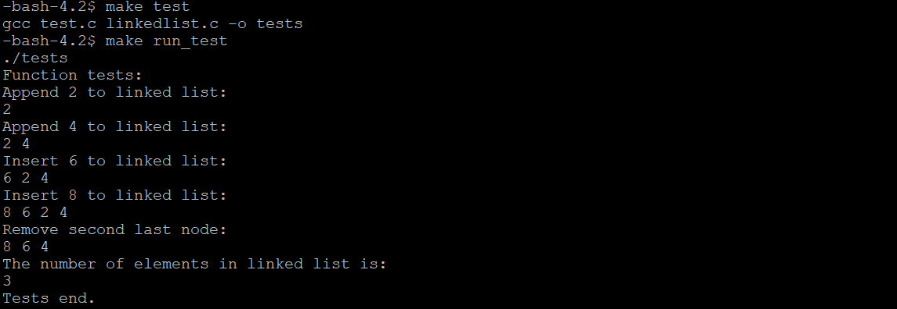
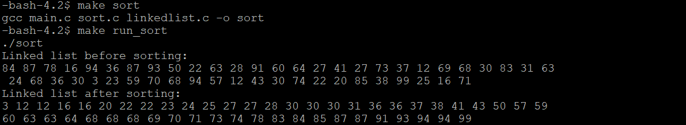

## Description
Here is the source code of sorting a doubly linked list using insertion sort algorithm. The C program is successfully compiled and run on a Linux system. The program output is also shown below.

## File Instructions
* linkedlist.h (definition of DoublyLinkedList and function prototypes)
* linkedlist.c (implementation of linkedlist.h)
* sort.h (function prototypes of insertion sort)
* sort.c (implementations of sort.h)
* test.c (manual operations on DoublyLinkedList for test purposes)
* main.c (generate DoublyLinkedList with random numbers and sort it)
* Makefile (complie and run)


## Makefile Instruction
```c
#compiles test.c
make test

#compiles main.c
make sort

#run test.c
make run_test

#run main.c
make run_sort
```

## Output


